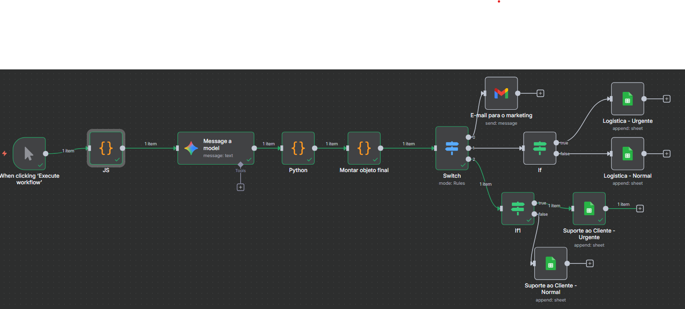

# Automação Inteligente de Atendimento - Case Prático para Gocase

### Este é um projeto que construí para demonstrar minhas habilidades em automação, integração de sistemas e aplicação de IA para resolver um problema de negócio real.

### Demonstração da automação no Google Sheets

### Demonstração da automação no Gmail

### Demonstração completa e dinâmica (clique no PNG para acessar o vídeo no youtube)

### O Problema: Atendimento ao Cliente digital no Século 21 é Caótico

Marcas como a Gocase, com forte presença digital, recebem feedback de clientes em todos os lugares: comentários em anúncios, DMs no Instagram, posts no Facebook, posts no Instagram.

Deixar esses comentários sem resposta é arriscado, e "caçar" cada um deles manualmente é lento e ineficiente.

### A Solução: Uma "Central de Triagem" Inteligente e Automática

Esse workflow em n8n funciona como um sistema que centraliza e age sobre esses feedbacks em tempo real.

**O que ele faz na prática?**

1.  **Captura:** Simula a chegada de comentários de diversas fontes (neste case, a partir de um nó de código em **JavaScript** com múltiplos cenários de teste, escolhendo um cenário aleátorio por vez).
2.  **Análise e Triagem com IA:** Usa a API do **Google Gemini** para ler o comentário e extrair informações cruciais através do comentário do usuário: sentimento, categoria do problema  e qual time interno deveria cuidar do caso.
3.  **Padronização e Lógica de Negócio:** Um script em **Python** para:
    * **Limpar os dados** extraídos pela IA, garantindo um formato padrão e confiável. Ex: Se o usuário informar o número do pedido no comentário, utilizo a biblioteca `re` para pegar somente o número do pedido, independente se o cliente informar algum character especial.
    * Aplicar **regras de negócio customizadas**, como calcular um nível de urgência com base na categoria e no sentimento.
4.  **Roteamento e Priorização:** Um nó **Switch** direciona a tarefa para o time correto. Em seguida, caso o ticket seja para os times de Logistica ou Suporte, nós **IF** aninhados verificam a urgência, separando os casos críticos dos normais e criando filas de atendimento especializadas.
5.  **Ações Finais:** O sistema executa ações concretas e específicas para cada cenário, como: adicionar tickets em diferentes abas de uma planilha no Google Sheets e enviar e-mails dinâmicos para o time de Marketing com insights.

### Destaques e Decisões de Arquitetura

Além de construir o fluxo, tomei algumas decisões de arquitetura para tornar a solução mais robusta e profissional:

* **Função Embarcada vs. API Própria:** A lógica em Python foi implementada como uma função "embarcada" no n8n por ser mais performática e simples para o escopo do projeto. A decisão de externalizar isso para uma API própria seria considerada se a mesma lógica precisasse ser reutilizada por múltiplos outros sistemas.
* **Camada de Padronização:** Percebi que a saída da IA generativa não é 100% determinística. Para garantir a consistência, adicionei uma função em Python especificamente para padronizar os dados extraídos, tratando diferentes formatos e garantindo que o resto do sistema sempre receba um dado previsível.
* **Consolidação de Dados:** Utilizei um nó `Code` para unir os dados originais do comentário do cliente com os dados analisados pela IA/Python. Isso cria um "objeto de dados final" que simplifica as expressões e a manutenção dos nós seguintes, que passam a ter uma única fonte da verdade.
* **Switch vs. IF:** Optei por um nó `Switch` para o roteamento principal por ser semanticamente mais claro e limpo para direcionar tarefas com base em um único valor (`setor_sugerido`). Os `IF`s foram usados para a lógica de priorização secundária.

### Ferramentas e Tecnologias

* **Workspace:** n8n
* **IA Generativa:** Google Gemini API
* **Linguagens:** Python (com a biblioteca `re`) e JavaScript
* **Integrações:** Google Sheets e Gmail
